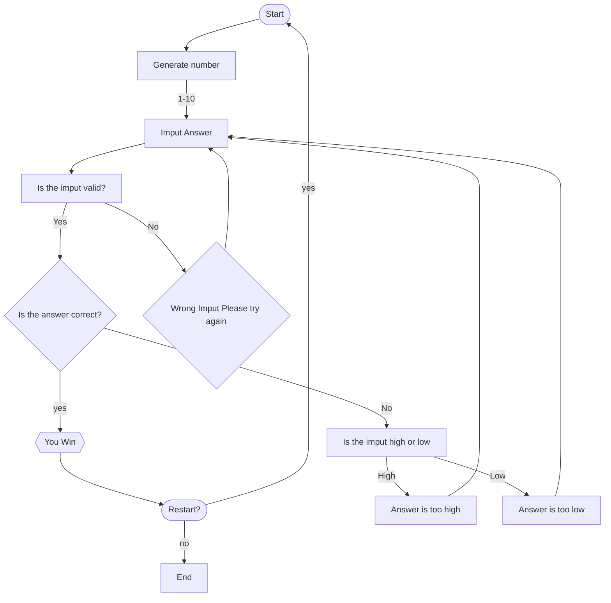

## Implementing a Random Guessing Game

##### This flowchart illustrate how the guessing game works. 
First, it will start by generating a number then it will ask to imput an answer. Then, it the game will verify if the answer is valid. After, it will determine if the answer is correct but if no then it will provide feedback and will sent back to imputing an answer. If the answer is correct then game will ask to restart the game.
